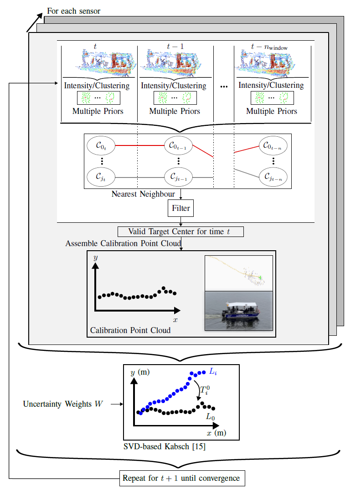

# SIMPLE-C
##  SIMPLE-C: Multi-LiDAR Extrinsic Calibration using a Simple Moving Reflective Target in Feature-Sparse Maritime Environments

<p align="center">
  
</p>

This calibration tool can be used for calibrating multiple LiDAR sensors using a simple reflective target that is moved through the environment while being tracked. The tool was created to allow for pairwise calibration of LiDAR sensors on large vessels. The vessel is docked on the water introducing a unintendedly moving sensor platform and a moving environment (water surface), meaning that we cannot use any feature- or environment-based calibration algorithm. Also, we cannot use static targets as they would constantly move on the water surface. Further, as large vessels are often expensive to move, we created a tool that does not require any movement of the platform to calibrate sensors. We also omit the use of external auxiliary sensors such as IMU or GNSS, the need to manufacture complex shaped targets or algorithms that rely on geometric shape detection and calculation. Our calibration tool can be used indoor, outdoor and on waterside making the tool available for many users, applications and environments. Additionally, the tool is online-capable such that live feedback can be used to optimize the calibration procedure or parameters. For point cloud registration we rely on a simple weighted Kabsch Algorithm.

We demonstrate a robust and simple online calibration tool for LiDAR sensors in maritime applications.

Code authors are Tim Rehbronn and [Max Viehl](mailto:15348204+m-viehl@users.noreply.github.com), both are with the Institute of Automatic Control, RWTH Aachen.

## Running the calibration

### Online calibration in ROS/Docker

To use the tool, we propose to use our docker container with all dependencies and packages pre-installed and built: **[Docker-Repostiory](https://git-ce.rwth-aachen.de/g-nav-mob-irt/projects/galileonautic2plus/calibration/robosense_docker)**

You can also run the tool without docker on your system:

`ros2 run online_calibration main --ros-args --params-file /PATH/TO/parameters.yaml -p sensor_pairs:="<PAIRS>"`

The `/PATH/TO/parameters.yaml` must be the path **inside** the docker container! Make sure that the parameter file is somehow accessible inside the docker container for ROS to read it. (As the source code of this ROS package contains it, it has probably already been copied to docker.)

Replace `<PAIRS>` with a sensor pair definition using the following syntax: `topicA,topicB;topicB,topicC`. Pairs are separated using semicolons, in a single pair, the two sensors are comma-separated. The first topic called is the child topic and the second the parent topic. Calibration finds the transformation from parent to child.

The ros node will then listen to PointCloud2 messages on the provided topics and push calibrations to the topic `transformations`. Status information is currently (**TODO**) provided on stdout (command line of the ros node).  All transformations use the message type `TransformStamped`, which includes information about the involved coordinate frames (here: sensor topic names). Therefore, transformations for multiple sensor can be pushed to the same ROS topic.

To run the calibration tool online on already captured data from ROS bags, you can simply play back the ROS bags in the docker container and run the calibration tool simultaneously to get the calibration parameters.

You can find a **web-based visualization** in **[this repo](https://git-ce.rwth-aachen.de/g-nav-mob-irt/projects/galileonautic2plus/calibration/web_visualization)** and call it via `localhost:8000`

The transformations will be stored in `transformations.log` at `"log_path": "/DATA/log_files"` as set in the default parameters or launch file.

### Offline calibration (Debug Mode)

- Using the script `online_calibration/main_cli.py`, the calibration can be used without ROS (pass `--help` for usage information) by importing ROS-bags as numpy arrays.
- Reading rosbag data is used using separate libraries.
- Currently only reading ROS1 bags is supported (if you want to use ROS2 bags, you can use the online tool without debug purpose)
- Visualizations of reflector tracking and point pair alignment are available, which are not available inside of ROS.
- As rosbag import is very slow, it might be faster to run the ROS node and play back the rosbag using ROS itself as long as no visualization is required.

### Using the Calibration
The transformation computed by the calibration module is stored in `transformations.log` which can be read by the transformation broker [from this repo](https://git-ce.rwth-aachen.de/g-nav-mob-irt/projects/galileonautic2plus/calibration/calibration_transformation_broker) that publishes the corresponding transformation messages.

### Evaluation data logging
For development and evaluation, in addition to logs of the whole console output,
the program can write information about the calculated transformations to JSON files.

This functionality is managed by the ROS parameter `eval_log_dir`. This can be set to "none" to disable the logs. Otherwise, a directory should be specified, to which log files will be written.

There is **one log file per program run and per sensor pair**, which is updated whenever a new transformation is available. The filenames are as follows: `"calib_log_{timestamp}_{topic1}_{topic2}.json"`.

Each JSON file is structured as follows:
```json
{
  "transformations": [
      // list of "transformation info dicts"
  ]
  // (this may be extended with further information later)
}
```

The structure of the "transformation info dicts" is:
```json
{
"R": [
   [
      0.999492098067459,
      -0.005532258631072325,
      -0.031383754000243125
   ],
   [
      0.004253334204850159,
      0.9991634771255027,
      -0.04067253528631841
   ],
   [
      0.03158251175651966,
      0.040518392032679304,
      0.998679530609412
   ]
],
"R_sensitivity": [
   [
      0.011162393815827044,
      -0.018766981873872594,
      0.0013434460301343723
   ],
   [
      -0.018766981873872594,
      0.03641271478917377,
      -0.002514645113975557
   ],
   [
      0.0013434460301343723,
      -0.002514645113975557,
      0.001352084002737808
   ]
],
"t": [
   0.09161414476495366,
   0.9594284458110778,
   -0.9511697314845842
],
"topic_from": "/rslidar_points_l",
"topic_to": "/rslidar_points_r",
"point_pairs_used": 91,
"point_pairs_total": 91
}
```


## Code structure
- All code lives inside the `src` directory in the ROS package `online_calibration`. 
- The code is split up into three parts:
  1. ROS-specific code. This is all code outside of the `core` and `local` directories.
  2. A part for local execution (and debugging/visualization using open3d) independent of ROS. This code is in `local` and is started from the script file `online_calibration/main_cli.py`.
  3. The shared logic code which is used by both of these launching methods is contained inside the `core` directory.
- To get familiar with the code, starting in `main_ros.py` should be a good entry point for understanding the main logic. The ROS-independent code uses other data imports and calls the logic differently.

## Functional overview

**Data import**:

Single ROS PointCloud2 messages are parsed (either coming from a Rosbag file, see `local/rosbag_import.py` or from a ROS message, see `online_calibrator.py`) to numpy arrays. These contain the unordered single scanned points in the format (x, y, z, intensity, ring, timestamp). The fields ring and timestamp are currently unused.

The frame data is then fed into `Frame` objects (`core/frame.py`). These do some caching of expensive per-frame analysis results, which is useful because one frame might be used to align multiple sensor pairs.

**Calibrating (multiple) pairs of sensors**  
In a single run of the program, multiple sensor pairs should be calibrated, which usually share sensors (e.g. A-B and B-C). In the following, only calibration of a single sensor pair is described, which is handled by a single `PairCalibrator` object. In the ROS node, an `OnlineCalibrator` object distributes the correct frame data to multiple of these to allow for simultaneous calibration of multiple pairs.

**PairCalibrator: Timing of frame data**  
A PairCalibrator has a callback function `new_frame`, which is passed `Frame` objects for both sensors (in real-time) as soon as they are recorded. As the Kabsch algorithm requires pairs of points, i.e. corresponding frames of both sensors, these frames are cached until data has been received from each sensor. Frame acquisition can not be triggered at the Lidar sensors used for this project. Therefore, frames are simply dropped if they are older than 60% of the expected time delay between two frames.

<p align="center">
  
</p>

**Reflector detection using Backtracking and Filtering**  
A series of processing steps is used to identify the detector in the data *of a single sensor*.

1. The reflector is expected to result in very intense points in the lidar frame. Hence points are filtered using a threshold value for the intensity channel. The threshold value is calculated adaptively: $I_\text{adapt.} = w_\text{I} \cdot I_\text{max}$ (configurable by the parameter `"relative intensity threshold"`).

2. These remaining points are then expected to be from distinct bright objects. The DBSCAN algorithm is used for clustering, configurable by the parameters `"DBSCAN epsilon"` (in meters, as is all coordinate data from the sensors) and `"DBSCAN min samples"`.

These steps are performed in the file `core/locate_reflector/find_cluster_centers.py`. Results are cached in the `Frame` class because until now, they are independent of sensor pairs.

To differentiate between the reflector and static reflective objects (or almost static, such as trees), sequences of successive frames are now used for further analysis. The length of each sequence is adjusted by `"window size"`. Results are only calculated for the *last* frame in a sequence though.

3. For each cluster found in the last frame of a sequence, the trace of successive nearest neighbors (in the previous frame respectively) is determined. These traces are then filtered using multiple rules. It is assumed that if one trace passes all those filters, it belongs to the reflector.
   - We expect the reflector to be visible in the whole sequence. Sequences which are too short are dropped.
   - The reflector is supposed to move to distinguish from static objects. If the *average* distance between two adjacent points is too small (`"minimum velocity"`, in meters \[per frame]), the trace is dropped.
   - The reflector is also not supposed to jump/move very quickly, so with `"maximum neighbor distance"` there is also an upper threshold for the distance between two adjacent frames (here, no average is used).
   - The reflector is expected to not change its movement direction too drastically. Therefore, the angle between adjacent movement vectors must not exceed a certain limit (`"max. vector angle [deg]"`). This filter aims to distinguish it from randomly moving objects, such as water reflections or trees.
   - The number of points in the cluster resembling the reflector is expected to not change drastically. If the difference in point number changes by a certain percentage between two frames (`"max_point_number_change_ratio"`), traces are also dropped.

4. If a single trace passes all those filters, a `ReflectorLocation` object is created, which stores information about the cluster that is identified to originate from the reflector. It is intentionally avoided to store the whole frame data to reduce memory usage.

5. If the reflector has been found in corresponding frames of both sensors, these locations are considered a *point pair*. These point pairs are stored and if more than three have been found, they can be passed to the Kabsch algorithm to calculate the transformation. As more data is acquired, the transformation is successively updated. This allows to run the calibration online in real-time. Using the sensitivity (uncertainty) of the current transformation, the operator can decide whether enough data has been collected for the required precision.

6. **Adaptive Outlier Rejection:** As soon as an initial transformation exists, further filtering is applied to remove outliers that might have passed all filters described in step 3. To accomplish this, all point pairs of one sensor are transformed, which should ideally result in perfectly aligned point clouds. The mean distance between two adjacent points (after transformation) is calculated and point pairs with a much greater distance (`mean_distance * "outlier_mean_factor"`) are excluded before the transformation is calculated.

7. **The Kabsch algorithm** accepts weights for each point pair. This allows for using weights to consider uncertainty or an indicator of the targets relaibility for calibration purposes. This weight is composed of three subweights:
   - **Assumption**: The more points there are in a valid cluster, the more reliable is the estimation of the target center. Activate the weight by setting `point_number_weight: 1`
      - **Weight** $w_1$: The number of points in the cluster, divided by the maximum number of all clusters identified as the reflector.
   - **Assumption**: The position of the reflector's center can be calculated more accurately if the reflector surface points are faced directly towards the sensor. Activate the weight by setting `normal_cosine_weight: 1`
      - **Weight** $w_2$: The cosine similarity of the normal vector of the reflector surface and the vector from sensor (in the origin) to the cluster centroid. The normal vector is calculated using an SVD, assuming the points to be distributed approximately planar. 
   - **Assumption**: As the sensor outputs *x, y, z* coordinates but measures radial distance *r*, there is a range dependent error or uncertainty in the coordinates. Activate the weight by setting `gaussian_range_weight: 1`
      - **Weight** $w_3$: The weight is inversely proportional to the squared radial distance to the sensors origin. The further away the measurement is, the higher the uncertainty and the lower the weight.
   - **Combined Weight**: Multiplicative linkage of the subweights to avoid further hyperparameters and induce an AND-logic to the weights. $w = w_1 * w_2 * w_3$ The weights can individually be turned on/off.

8. **Convergence:** The tool stops calibration if the standard deviation of the corresponding-point distances reach a certain threhsold in each dimension (x, y, z). A minimum runtime of $n$ iterations is required. Further, we have added convergence criteria for root mean square error of point-wise distances to evaluate the quality of the transformation. Additionally, we use the eigenvalues and condition number of the covariance matrix of $\mathcal{P}$ as indicators of geometric quality. You can set the convergence threshold for each dimension in `convergence_threshold: [x_thres, y_thres, z_thres]`, the minimum number of iterations until the criterion is used with `minimum_iterations_until_convergence`, the rmse threshold with `rmse_threshold`, the eigenvalue threshold with `min_eigenvalue_threshold` and the condition number with `condition_number_threshold`. Please note that the convergence is not properly tested or analyzed.

   Note that the algorithm only accepts a *single* weight per point *pair*, not per point. Therefore, the minimum weight of the points in a pair is used.
